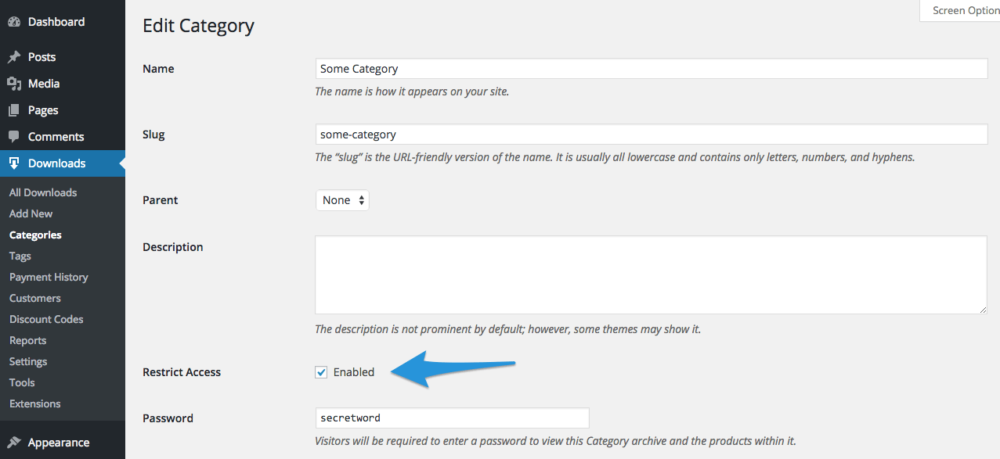

<!-- DO NOT EDIT THIS FILE; it is auto-generated from readme.txt -->
# WooCommerce Restrict Categories

Password protect your product category archives, and the products inside them.

**Contributors:** [fjarrett](https://profiles.wordpress.org/fjarrett)  
**Tags:** [ecommerce](https://wordpress.org/plugins/tags/ecommerce), [shop](https://wordpress.org/plugins/tags/shop), [shopping](https://wordpress.org/plugins/tags/shopping), [store](https://wordpress.org/plugins/tags/store), [woocommerce](https://wordpress.org/plugins/tags/woocommerce)  
**Requires at least:** 4.0  
**Tested up to:** 4.2  
**Stable tag:** 1.0.0  
**License:** [GPLv3](https://www.gnu.org/licenses/gpl-3.0.html)  
**WC requires at least:** 2.1.0  
**WC tested up to:** 2.3.9  

## Description ##

Take full control over who can access your product category archives!

 * Feature certain products for VIP customers only
 * Great for membership sites with members-only product categories
 * Prompts users for a password when they attempt to access a restricted category
 * Products belonging to restricted categories are automatically password protected too
 * Whitelist roles and users who should always have access without requiring a password

## Frequently Asked Questions ##

## Screenshots ##

### Users are prompted to unlock restricted content before viewing

## Changelog ##

### 1.0.0 - May 25, 2015 ###
* Initial release

Props [fjarrett](https://github.com/fjarrett)

